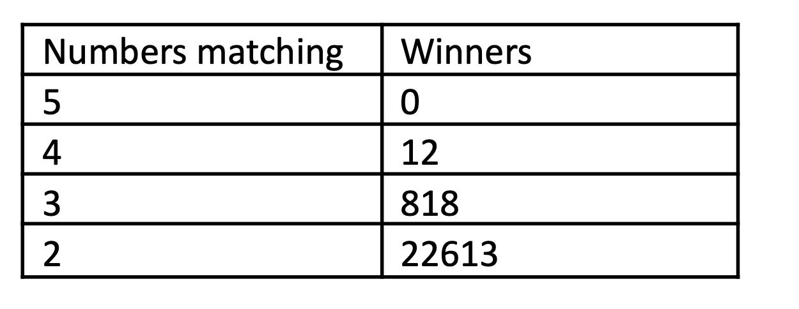

## Hangarin Lottery problem

how to run:
`go build -o myapp` && `./myapp <filename>`


## Problem statement
This problem is related to the Hungarian lottery. In case you are not familiar with it: players pick 5 distinct numbers from 1 to 90.
There is a weekly lottery picking event when the lotto organization picks 5 distinct numbers randomly between 1 and 90 – just like the players did.
A player’s reward then depends on how many of the player’s numbers match with the ones selected at the lotto picking. 
A player wins if they have 2, 3, 4 or 5 matching numbers.

Now, the problem: at the lottery event, right after picking the numbers, a computer shall be able to report quickly 
that how many winners are in each category, for example:



This report shall be generated as soon as possible after picking the winning numbers. 
The players' numbers are known a few minutes before the show starts. In peak periods, there are currently about 10 million players.
* Write an optimized solution that can report the results in 100ms or less
* Document the asymptotic run time of your solution
* Use code comments (enough to make it easy to understand)
* Document your ideas about how you could further improve the calculation speed or handle more players
* Submit your code by email or share it privately (do not share it in public space like github), including instructions on how to build and run

### Algorithm

The algorithm is based on the following idea:

The first step we need to read the file and create our bitset struct, to
read the file we create an type which will read and validate the file

`ReadFileInformation` is a function that reads the file and returns an struct `FileType`
with the items of the file which is and `[][]int` 2D slice with all valid numbers
this function took the time complexity of O(n*k) wheres n is the number of lines
and k is in the worst case 5, beacuse we need to validate the numbers "3 4 5 6 7"
so the complexity time is `O(n*5) = O(n)` in terms of memory this function 
allocates `O(n*5)` which is the slice of the numbers, and holds the number of lines and
the filename in the memory

tldr: `O(n)` time complexity and `O(n*5) = O(n) 2D slice` memory complexity

after reading the file we need to create the bitset struct, this struct will holds
the length which 91, this 0...91 numbers will be the indexes of the bitset, and
creates the bitset that will be 2D slice [0..91][u64] I think we can represent every
possible number with 64 bits, so the numberSizeOfElement is = (number of lines in the file  + 63 )/ 64
this will give a number that cannot be multiple of 64. then we instanciate the
slice of the bitset [0][uint64*numerSizeOfElement] and we iterate over the numbers
we might have something [[000000000...], [000000...],,, [0000000000...]] from 0 to 91 

tldr: `O(n)` time complexity and `O(n*numerSizeOfElement)` memory complexity
then we need to set the bitset with the numbers that we read from the file
for each line of the file we iterate over the numbers, and we set the bitset

for the 3 equal numbers `[[4 79 13 80 56] [4 79 13 80 56] [4 79 13 80 56]]`
we go over and we will set the bitset with the number 4, 79, 13, 80, 56
for the first item 0, and the number 4  the index to set will be (0/64) = 0 and the offset will be (index % 64) = 0
setting the `bitset[0][0] = 1 << 0` we have now `[[0], [0], [0], [0...1], .. [0]]`

after iterating over the numbers we have the bitset setted with the numbers
```
Bitset: &{11 [[0] [0] [0] [0] [111] [0] [0] [0] [0] [0] [0] [0] [0] 
[111] [0] [0] [0] [0] [0] [0] [0] [0] [0] [0] [0] [0] [0] [0] [0] 
[0] [0] [0] [0] [0] [0] [0] [0] [0] [0] [0] [0] [0] [0] [0] [0] [0] [0] 
[0] [0] [0] [0] [0] [0] [0] [0] [0] [111] [0] [0] [0] [0] [0] [0] 
[0] [0] [0] [0] [0] [0] [0] [0] [0] [0] [0] [0] [0] [0] [0] [0] 
[111] [111] [0] [0] [0] [0] [0] [0] [0] [0] [0] [0]]}
```
for the 3 games

tldr: 
`O(91)` to  call the `NewBitset` where 91 is the number of possible numbers (I will call it indexes)
`O(n)` to set where n is the number of lines in the file  and will call the SetBits
which will run over the numbers `O(5)` so to create and populate the bitset

`O(91) + O(n)* O(5) = O(91) + O(5n) = O(5n) = O(n)` time complexity


time complexity and `O(n*numerSizeOfElement) which is a 2D slice [][]uint64*numberSizeOfElement` memory complexity


After build the bitset we need to receive the winner number from the input and run
the query over our bitset, to find all the winners for 5, 4, 3 and 2 numbers

lets say we have the winner numbers [4 79 13 80 56] we will iterate over the numbers
we will select the bitset for which number we are looking for, for the number 4
so the selected bitset will be  [[111], [111], [111], [111], [111]] which means there is 3
games played that match all numbers.

but lets say we had a file with
`[[4 79 13 80 56] [4 79 13 80 56] [4 2 13 8 6]]`
so our selected bitset will be `[[111], [111], [011], [011], [011]]`
means that there are 2 games that match all numbers and there is 1 game that match 2 numbers

but lets say the number winner is [79 80 13 4 56] is the same result but there is a 
combination of numbers we have to check all the possible combinations of the numbers

then when we count the winners `q.countWinnerIntersection(5)` the combination
C(5, 5) = 1 giving the following: 

C(n,k)= n!/(k!(n-k)!) = 5!/(5!(5-5)!) = 1

k=5, find how many intersections occur when considering all 5 winning numbers.

For k=5, generate all combinations of size 5 from the indices ` [1, 2, 3, 4, 5]`

There's only one combination when 

iteration k=5
combination `[1 2 3 4 5]`

Start with the bitset at index 0: `[111]`
- Perform a bitwise AND with the bitset at index 1:
- intersection = `[111]&[111]=[111]`

- Perform a bitwise AND with the bitset at index 2:
- intersection = `[111]&[011]=[011]`

- Perform a bitwise AND with the bitset at index 3:
- intersection = `[011]&[011]=[011]`

- Perform a bitwise AND with the bitset at index 4:
- intersection =  `[011]&[011]=[011]`

Count the number of set bits in the final intersection:
- intersection = `[011]`
- count = 2


For `countWinnerIntersection(4)`

- Generate Combinations
For k = 4 , generate all combinations of 4 indices from `[0, 1, 2, 3, 4]`:
`[[0, 1, 2, 3], [0, 1, 2, 4], [0, 1, 3, 4], [0, 2, 3, 4], [1, 2, 3, 4]]`

Iterations
1. Combination `[0, 1, 2, 3]`:
   - Start with the intersection of index 0: `[111]`
   - AND with index 1: `[111] & [111] = [111]`
   - AND with index 2: `[111] & [011] = [011]`
   - AND with index 3: `[011] & [011] = [011]`
   - Count set bits: **2**

2. Combination `[0, 1, 2, 4]`:
   - Start with the intersection of index 0: `[111]`
   - AND with index 1: `[111] & [111] = [111]`
   - AND with index 2: `[111] & [011] = [011]`
   - AND with index 4: `[011] & [011] = [011]`
   - Count set bits: 2

3. Combination `[0, 1, 3, 4]`:
   - Start with the intersection of index 0: `[111]`
   - AND with index 1: `[111] & [111] = [111]`
   - AND with index 3: `[111] & [011] = [011]`
   - AND with index 4: `[011] & [011] = [011]`
   - Count set bits: 2

4. Combination `[0, 2, 3, 4]`:
   - Start with the intersection of index 0: `[111]`
   - AND with index 2: `[111] & [011] = [011]`
   - AND with index 3: `[011] & [011] = [011]`
   - AND with index 4: `[011] & [011] = [011]`
   - Count set bits: 2

5. Combination `[1, 2, 3, 4]`:
   - Start with the intersection of index 1: `[111]`
   - AND with index 2: `[111] & [011] = [011]`
   - AND with index 3: `[011] & [011] = [011]`
   - AND with index 4: `[011] & [011] = [011]`
   - Count set bits: 2

countWinnerIntersection(4) = 2 + 2 + 2 + 2 + 2 = 10

For `countWinnerIntersection(3)`

For k = 3 , generate all combinations of 3 indices from `[0, 1, 2, 3, 4]`:
`[[0, 1, 2], [0, 1, 3], [0, 1, 4], [0, 2, 3], [0, 2, 4], [0, 3, 4], [1, 2, 3], [1, 2, 4], [1, 3, 4], [2, 3, 4]]`
1. Each combination results in an intersection of `[011]`, with 2 set bits*
2. There are 10 combinations.

`countWinnerIntersection(3) = 10 combinations × 2 set bits = 20`


For `countWinnerIntersection(2)`
For ( k = 2 ), generate all combinations of 2 indices from `[0, 1, 2, 3, 4]`:
`[[0, 1], [0, 2], [0, 3], [0, 4], [1, 2], [1, 3], [1, 4], [2, 3], [2, 4], [3, 4]]`

Repeat the same process for each combination. For brevity:

1. Each combination results in an intersection of `[011]` or `[111]`.
   - `[0, 1]` results in `[111]` with **3 set bits**.
   - All other combinations result in `[011]` with **2 set bits**.
2. There are **10 combinations**, with **1 combination having 3 bits** and the rest having 2 bits.

`countWinnerIntersection(2) = 3 (from [0, 1]) + 9 × 2 = 21`

now we have to exclude the numbers from high level intersections, for example

Results Before Exclusion
  - countWinnerIntersection(5) = 2 
  - countWinnerIntersection(4) = 10 
  - countWinnerIntersection(3) = 20 
  - countWinnerIntersection(2) = 21 

For each k, subtract the contribution of higher intersections:
1. For k = 4
   
   `countWinnerIntersection(4) - 5 *countWinnerIntersection(5)`
   Why? A player who matches all 5 numbers contributes to k = 4 intersections in C(5, 4) = 5 ways.
   Result for four = 10 - 5 * 2 = 10 - 10 = 0

2. For k = 3
   `countWinnerIntersection(3) - 4 result for four - 10 * countWinnerIntersection(5)`
   Why?
   - A player who matches exactly 4 numbers contributes to k = 3 intersections in C(4, 3) = 4 ways.
   - A player who matches all 5 numbers contributes to k = 3 intersections in C(5, 3) = 10 ways.
   Result for tree = 20 - 4 *  0 - 10 *  2 = 20 - 0 - 20 = 0

3. For k = 2
   `countWinnerIntersection(2) - 3 * result for three - 6 result for four - 10  * countWinnerIntersection(5)`
   Why?
   - A player who matches exactly 3 numbers contributes to k = 2 intersections in C(3, 2) = 3 ways.
   - A player who matches exactly 4 numbers contributes to k = 2 intersections in C(4, 2) = 6 ways.
   - A player who matches all 5 numbers contributes to k = 2 intersections in C(5, 2) = 10 ways.
   result for two =  21 - 3 *  0 - 6 *  0 - 10 *  2 = 21 - 0 - 0 - 20 = 1


Results After Exclusion

    - countWinnerIntersection(5) = 2 

    - countWinnerIntersection(4) = 0 

    - countWinnerIntersection(3) = 0 

    - countWinnerIntersection(2) = 1


The complexity of calling `countWinnerIntersection(k)` for k = 5, 4, 3, 2 depends on the number of combinations generated and the 
operations performed for each combination. 

Complexity for generating combinations:
O((n k)) = n! / (k! (n - k)!)
this is the number of combinations of k items from n.

Complexity for Performing Intersection for Each Combination

For each combination, the function:
1. Takes the bitset of indices in the combination.
2. Performs a bitwise AND operation across k bitsets, which takes: `O(m)` where m is the length of each bitset (number of `uint64` words).

3. Counts the set bits in the resulting intersection, which also takes: `O(m)`

Thus, for each combination, the total time complexity is: `O(k * m)` 


tlrd: complexity and space for  k = 5, 4, 3, 2 

Assumptions:
    - n = 5: Number of bitsets (indices: `[0, 1, 2, 3, 4]`).
    - m : Length of the bitset in `uint64` words.

|  k  | C(n k) | Combinations | Time Complexity                      | Space Complexity                     |
|--------|---------------------|--------------|---------------------------------------|---------------------------------------|
|  5     |  1             | `[[0, 1, 2, 3, 4]]` | O(1 * 5 * m) = O(5m)      | O(1 * 5 + m) = O(m)          |
|  4 |  5             | `[[0, 1, 2, 3], ...]` |  O(5 * 4 * m) = O(20m)      | O(5 * 4 + m) = O(20 + m)     |
|  3 |  10             | `[[0, 1, 2], ...]`    |  O(10 * 3 * m) = O(30m)     |  O(10 \cdot 3 + m) = O(30 + m)    |
|  2 |  10             | `[[0, 1], ...]`       | O(10 * 2 * m) = O(20m)     | O(10 \cdot 2 + m) = O(20 + m)    |

Combined Complexity: To compute `countWinnerIntersection(k)` for  k = 5, 4, 3, 2 ,
the total complexity is the sum of the complexities for each value of  k: Total Time Complexity: O(5m + 20m + 30m + 20m) = O(75m)

the space complexity for this part is  to allocate the combination O(C(n k) * k) each combinations
is a list of k indices, and there are C(n k), the space for imtermediate intersection O(m) 
where m is the length of the bitset then the complexity overall is
`O(C(n k) * k + m)`
